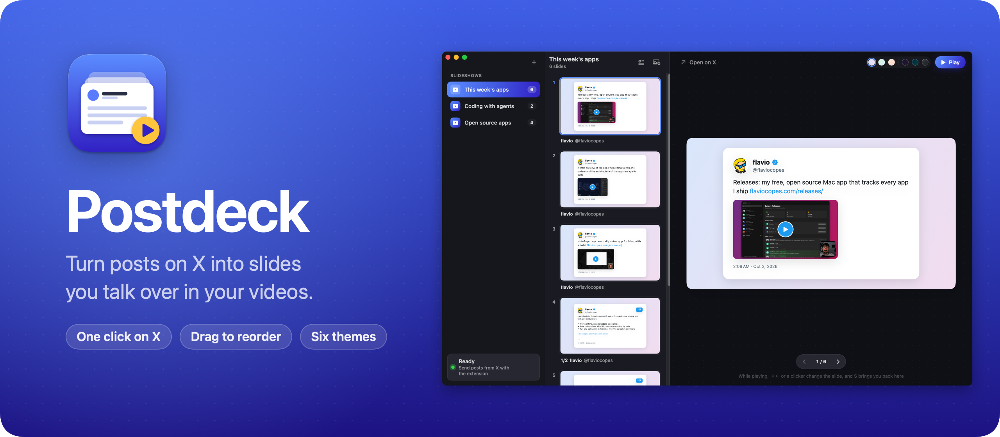
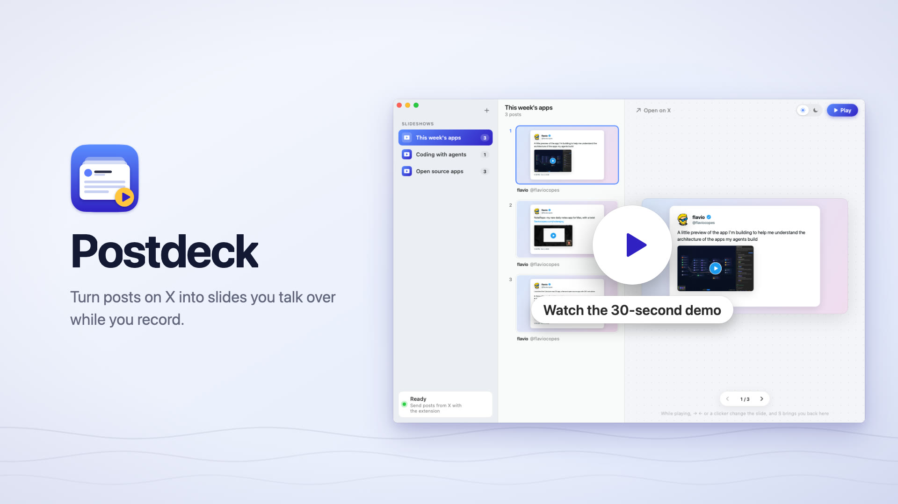
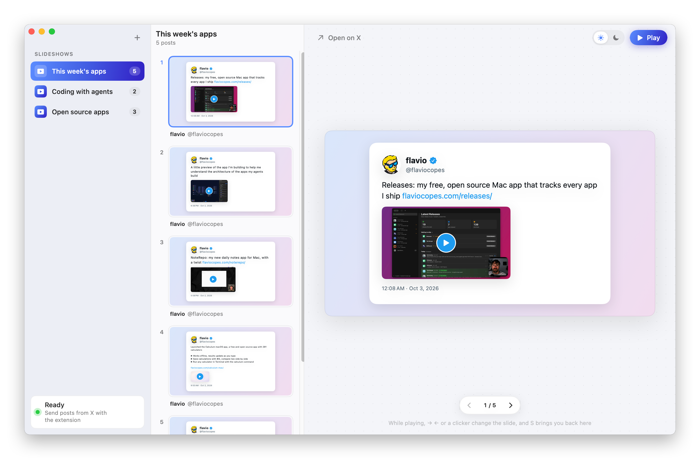
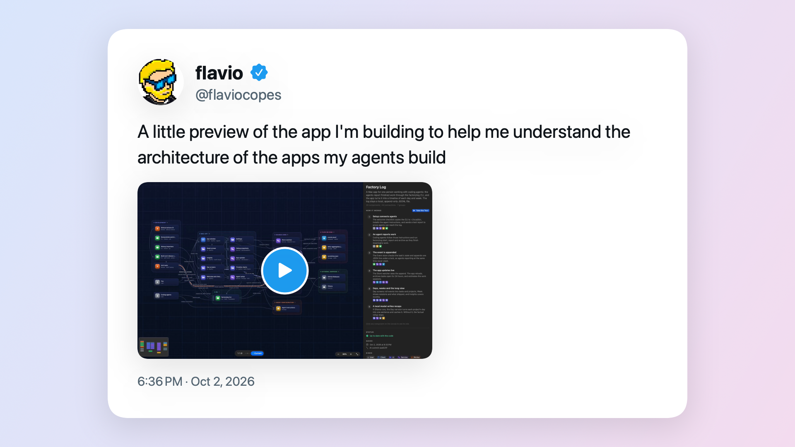

Postdeck turns posts on X into slides you talk over while you record a video. Click the slide icon under a post, and it shows up in the Postdeck Mac app as a slide, with the author, the avatar, the text and the images.

I record videos where I talk about posts on X. Recording X itself means scrolling, ads, replies and a busy timeline in the frame. Postdeck gives you a clean slideshow of just the posts you picked, in the order you want, ready to record.

Watch the 30-second demo:

[](https://flaviocopes.com/images/postdeck/demo.mp4)

## Download

Get `Postdeck-1.0.0.zip` from the [latest release](https://github.com/flaviocopes/postdeck/releases/latest) and unzip it. You get two things:

- `Postdeck.app`, the Mac app. Drag it to your Applications folder. It runs on macOS 14 Sonoma or later, on Apple silicon and Intel Macs.
- `Postdeck Extension`, the Chrome extension. Move this folder somewhere it can stay, like your Documents folder, because Chrome loads it from there.

To add the extension to Chrome:

1. Open `chrome://extensions` and turn on **Developer mode** in the top right corner.
2. Click **Load unpacked** and pick the `Postdeck Extension` folder.
3. Reload any X tab you have open.

### Opening it the first time

Postdeck is signed with my Apple Developer ID and notarized by Apple. The first time you open it, macOS asks if you're sure you want to open an app downloaded from the internet. Click **Open**.

On a work laptop you might not be able to install apps in `/Applications`. You can keep Postdeck in the `Applications` folder inside your home folder instead.

### Updates

Once a day, Postdeck asks GitHub whether there's a newer version. When there is, it shows what's new, and **Install and Relaunch** puts it in place of the old one. **Postdeck → Check for Updates…** checks right away.

To turn off the daily check, run this in Terminal:

```sh
defaults write com.flaviocopes.postdeck AppUpdaterAutomaticChecks -bool false
```

The extension doesn't update itself. When a release changes it, the release notes say so, and you replace the folder with the new one and click the reload arrow on the Postdeck card in `chrome://extensions`.

## How to use it

Keep Postdeck open while you browse X. Under each post you'll find a slide icon next to Like. Click it, and a message at the bottom of the page tells you which slideshow the post went to.

Every post goes to the slideshow selected in the app. Create one with ⌘N, and double-click a slideshow to rename it. The first post you send creates one for you.

<picture>
  <source media="(prefers-color-scheme: dark)" srcset="docs/screenshot-dark.png" />
  
</picture>

Then build the slideshow:

- Press ⌘T, or click the text button above the slides, to add a slide with your own text after the selected one. It has a title and, if you want, smaller text below it, like an intro before the first post. Type on the slide in the preview to change it.
- Drop images on the slides, like screenshots from your Desktop, and each one becomes a slide where you drop it, shown as large as it fits on the slideshow's background. Dropping them on the preview adds them after the selected slide, and ⇧⌘I or the image button above the slides lets you pick them. Postdeck keeps a copy, so the slide still works if you delete the original.
- Drag the slides to reorder them, or drop one on another slideshow in the sidebar to move it there.
- Click a slide and press Delete to remove it. Right-click it to open the post on X or move it to another slideshow.
- The swatches next to Play pick the slideshow's theme, the background and colors of every slide in it. There are three light themes and three dark ones, and each slideshow keeps its own.

When you're ready, press ⌘↩ or click **Play**. The window shows only the slide, with no buttons around it, so you can record it with your screen recorder. → and ← change the slide, and so do Space, Page Up and Page Down, so presentation clickers work too. Press S, Esc or ⌘↩ to go back to your slides.

While it plays, a small window shows you the next slide. It's a separate window, so it stays out of a recording of the main window. Drag it wherever you like, even to another display, and Postdeck puts it there next time.

<picture>
  <source media="(prefers-color-scheme: dark)" srcset="docs/slide-dark.png" />
  
</picture>

A few details that help while recording:

- Shorter posts get bigger text, so a one-liner fills the slide. Long posts split into readable pages marked 1/3, 2/3 and so on. Images go on the last page. Moving or deleting any part acts on the whole post.
- Replies show who they reply to.
- Videos show up as their thumbnail with a play button.
- If X cut a long post short in the timeline, open the post and click the slide icon again. Postdeck replaces the text with the full one.
- Slides are drawn at any window size, so they stay sharp in a small window or in full screen.

## Build slideshows with AI agents

Postdeck has a command line tool, `postdeck`, so an agent like Claude Code, Cursor or Codex can build a slideshow for you: create it, add text slides, images and posts, edit, reorder and remove them, and pick a theme. You see every change in the app right away.

Set it up from the **Postdeck** menu:

1. **Install Command Line Tool…** links `postdeck` into `~/.local/bin`.
2. **Install Agent Skill…** copies a skill to `~/.agents/skills/postdeck` and links it for Claude Code, Cursor and Codex, so they know when and how to use the command.

Then ask an agent something like "make a Postdeck slideshow for my video about this week's Mac apps, with an intro slide and the posts I sent you". Here's what it runs:

```sh
postdeck create "This week's apps" --theme midnight
postdeck add-text "This week's apps" "This week's apps" --subtitle "Four Mac apps I shipped"
postdeck add-post "This week's apps" releases.json
postdeck add-image "This week's apps" ~/Desktop/noterepo.png
postdeck show "This week's apps"
postdeck open "This week's apps"
```

`add-post` takes a post as the same JSON the extension sends, and `postdeck help add-post` shows the format. Run `postdeck help` for every command. Postdeck needs to be running, and the command opens it in the background when it isn't.

Run `postdeck capabilities` for a short list of what the command can do, with example invocations, and `postdeck capabilities --json` when an agent needs the machine-readable manifest.

## Privacy

Postdeck keeps everything on your Mac, in `~/Library/Application Support/Postdeck`. When a post arrives, the app downloads its avatar and images from X, so the slides work offline while you record. Once a day, it asks GitHub whether there's a newer version of Postdeck, and it downloads one only when you click **Install and Relaunch**. There are no accounts.

The extension reads a post from the page only when you click its button, and sends it to the app on your Mac. It runs only on x.com and twitter.com, and the only other place it can reach is the app. The `postdeck` command only talks to the app on your Mac.

## How it works

The extension can't talk to the app from the X page, so the page hands the post to the extension's service worker, which sends it to `http://127.0.0.1:7678`. That's a tiny HTTP server inside the app. It only listens on your Mac, and it refuses requests from web pages, so a website can't add posts to your slideshows. The `postdeck` command talks to the same server, so the app stays the only one that writes your library.

Reading a post from X is the fragile part, because X changes its markup. `extension/post.js` handles both the current markup and the older one with `data-testid` attributes. It reads the date from the post ID, since X's IDs carry a timestamp. The extension test runs against real X pages saved in `Tests/extension/fixtures`.

Each slide is laid out on a 1920×1080 canvas and every size is scaled to the window width, which keeps text and images sharp at any size.

## Build it from source

You need macOS 14 or later and Swift 6.2, which comes with Xcode 26.

```sh
swift run PostdeckApp
```

To build the release zip, with the app and the extension, run:

```sh
./Scripts/build-release.sh
```

It builds a universal app in `dist/Postdeck.app` and zips it with the extension into `dist/`. With my Developer ID certificate in the keychain it signs and notarizes the app. Everywhere else it signs it ad hoc, so your copy is signed ad hoc. A copy you build yourself opens without a warning on your Mac.

If you send it to another Mac, macOS says it "could not verify Postdeck is free of malware". Click **Done**, then go to **System Settings → Privacy & Security** and click **Open Anyway**, or remove the quarantine flag in Terminal:

```sh
xattr -dr com.apple.quarantine /Applications/Postdeck.app
```

## Development

```sh
swift test                              # the core tests
npm install && npm test                 # the extension in Chromium, against saved X pages (quit Postdeck first)
npm run capture-fixtures                # save fresh pages from x.com, needs Google Chrome
swift Scripts/render-icon.swift         # the app icon and the extension icons
./Scripts/screenshot.sh docs/demo-library /tmp/postdeck-shots   # the window and every slide of the demo library
swift Scripts/render-banner.swift       # docs/banner.png, from docs/screenshot-dark.png
```

Working with an AI coding agent? Point it at [AGENTS.md](AGENTS.md). It has the commands and the rules to follow.

## License

[MIT](LICENSE)
